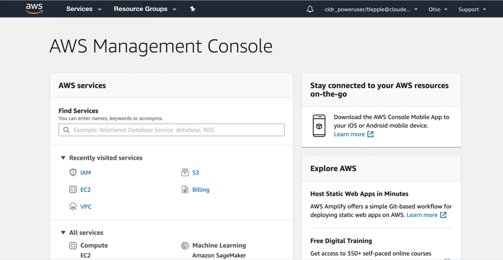

#  AWS Pre-Reqs

---
---
### Notes:
---

*  Follow the instructions in order.

---
---

1.  Navigate to the AWS service `IAM` and create the user:
* Make sure that the user name is only created in lower case

---

---

3. Save user credentials to your computer.

---

---

4.  Add new user to the `Admins` group

*  This step will appear to fail.  The root cause is that we do not have the IAM Permission to list users part of the group `Admins`

---

5.  Verify that your user is part of group `Admins`

---

6.  Create a Key Pair in the EC2 Service

---
---

